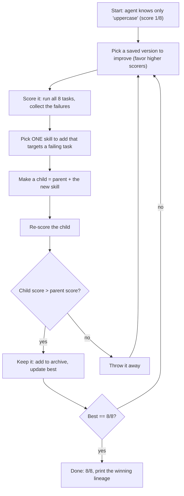

# 🧬 The Agent That Rewrites Its Own Code

A laptop-sized **Darwin-Gödel Machine**: an agent that reads its own failure log,
proposes edits to its own code, and keeps a change only if it *verifiably* scores higher
on a benchmark. Watch it climb from **1/8 → 8/8** — discovering a foundational skill that
unblocks the rest along the way.

> Inspired by the *Darwin Gödel Machine* (Zhang, Hu, Lu, Lange, Clune — arXiv:2505.22954,
> 2025), which swaps the original Gödel Machine's impossible "prove the edit helps
> first" for something practical: **propose, test on a benchmark, keep what empirically
> works, archive everything.**

No GPU, no API key. Runs in under a second.

## Run

```bash
python demo_cli.py      # the visual "score climbs" demo (record a GIF from this)
python dgm.py           # plain run: prints the winner's lineage
pip install pytest && pytest -q    # the self-improvement claims, as tests
```

## Files

| File | What it is |
|------|------------|
| `dgm.py` | The whole idea: agents, a verifiable benchmark, and the evolve() loop. |
| `demo_cli.py` | Terminal demo of the score climbing 1/8 → 8/8. |
| `test_dgm.py` | The claims as CI tests (base is weak, evolution strictly improves, no regressions). |
| `BLOG.md` | The write-up + a copy-paste LinkedIn post. |

## How it works (the loop)



**Steps:**
1. Begin with one skill (`uppercase`) — it only passes 1 of 8 tasks.
2. Pick a version from the archive to build on (better ones are more likely).
3. Run the benchmark; collect what's failing.
4. Add exactly one skill aimed at a failing task → a "child" version.
5. **Keep the child only if its score beat the parent's** (otherwise discard).
6. Repeat. One fix (input cleanup) unblocks two stuck tasks, jumping to 8/8.

## The one idea

> The Gödel Machine couldn't exist because it needed to *prove* a self-edit was good
> before making it. The Darwin Gödel Machine just **tries the edit and checks the score.**
> If you can write a function that checks the outcome, you can let an agent improve itself.

*Part of a 6-post series, "Toward Living Software." Written by Shridhar Shah —
[LinkedIn](https://www.linkedin.com/in/shridhar-shah-220b1721b/) ·
[GitHub](https://github.com/Shridhar-2205).*
