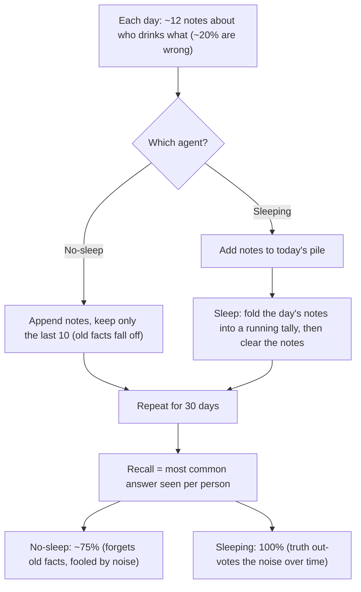

# 💤 Agents That Dream

Two agents learn the same noisy facts over 30 days, then take a memory test. The only
difference is whether the agent **"sleeps"** — consolidating each day's raw notes into a
running tally. Sleep takes it from **75% → 100%** recall.

No GPU, no API key. Runs in under a second.

## Run

```bash
python demo.py
```

## How it works (the flow)



**Steps:**
1. Every day generate ~12 observations; about 1 in 5 is wrong (like real logs).
2. **No-sleep agent** keeps only the last 10 raw notes — older facts get pushed out.
3. **Sleeping agent** adds counts into a per-person tally each night, then forgets the raw
   notes (keeps the summary).
4. After 30 days, each agent answers by the most common thing it remembers.
5. Counting across many days lets the truth out-vote the occasional wrong note → 100%.
