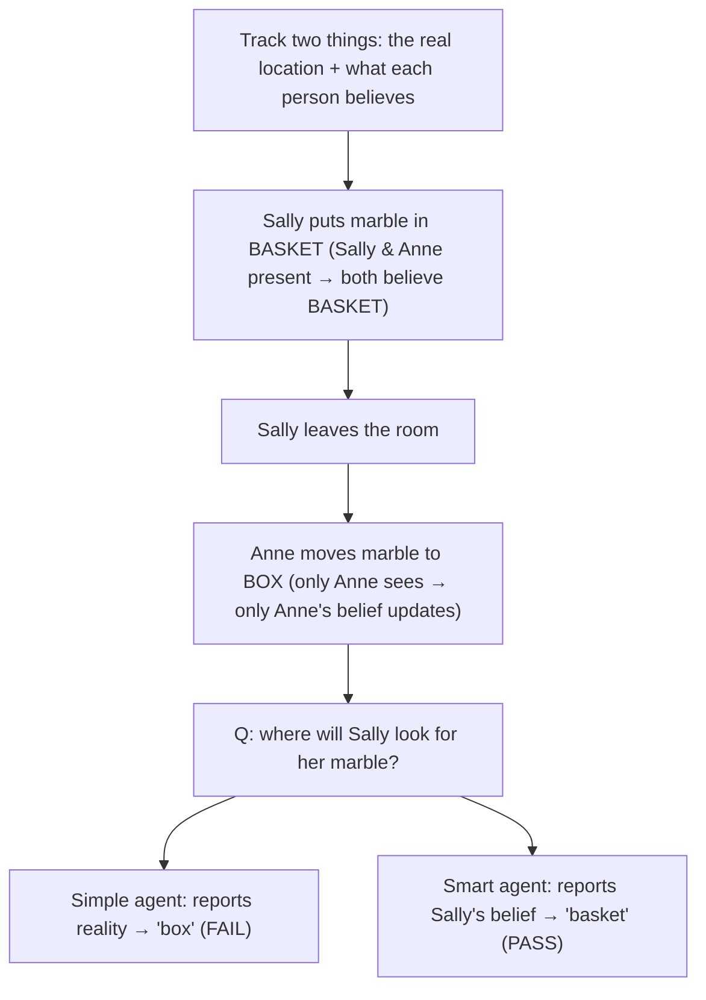

# 🧠 An Agent With a Theory of Mind

The **Sally-Anne false-belief test** (the one kids pass around age 4) in ~60 lines. A simple
agent only tracks what's *really* true and fails; a smarter agent tracks what *each person
believes* and passes.

No GPU, no API key. Runs instantly.

## Run

```bash
python demo.py
```

## How it works (the flow)



**Steps:**
1. Keep two maps: the marble's real location, and a separate belief per person.
2. A belief updates **only for people in the room** when something moves.
3. Sally + Anne both see it go in the basket → both believe "basket".
4. Sally leaves; Anne moves it to the box → only Anne's belief becomes "box".
5. The simple agent answers from reality ("box") and fails; the smart agent answers from
   Sally's belief ("basket") and passes.
