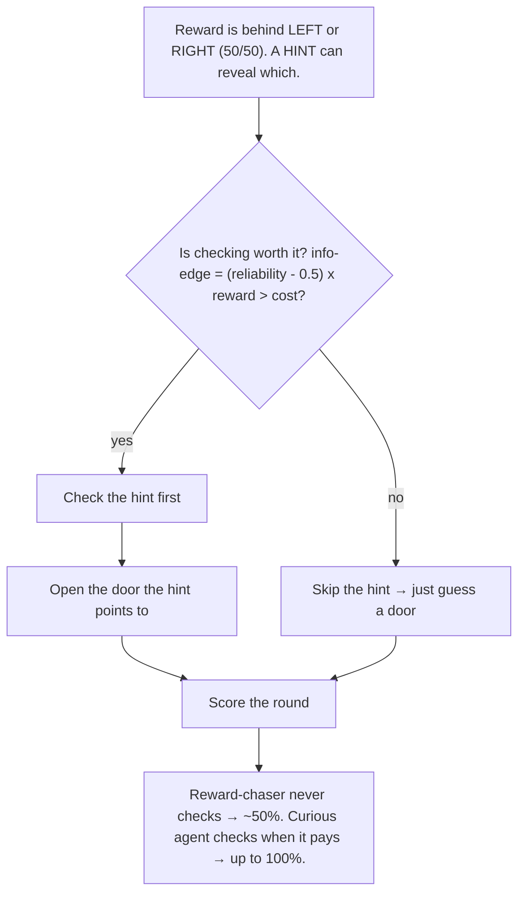

# 🔎 The Curious Agent

An agent that gets **curious on its own**. Instead of only chasing reward, it also tries to
reduce its uncertainty — so it learns to gather information before acting. That takes it from
**48% → 100%** on a simple task. Part 2 adds a cost + an unreliable hint to show the
trade-off has no hidden "exploration knob."

No GPU, no API key. Runs in under a second.

## Run

```bash
python demo.py
```

## How it works (the flow)



**Steps:**
1. The reward hides behind one of two doors; a hint reveals which — if you look.
2. Before acting, the agent weighs **how much the hint improves its odds** against
   **what checking costs**.
3. If the edge beats the cost → check first, then open the right door.
4. If the hint is too noisy or too expensive → it skips and just guesses.
5. Curiosity isn't bolted on; it falls out of "being unsure has a cost" — and switches off
   on its own when checking wouldn't pay.
