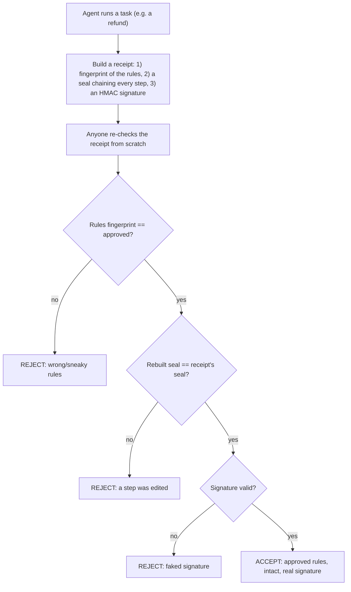

# 🧾 Verifiable Agent Behavior

Don't trust the agent — **check its receipt.** When the agent does something important (like
a refund), it produces a tamper-proof receipt that anyone can verify. Swap the rules, edit a
step, or fake the signature and the check fails.

Uses only standard hashing (SHA-256/HMAC). No API key. Runs instantly.

## Run

```bash
python demo.py
```

## How it works (the flow)



**Steps:**
1. The agent records its steps (rules, request, decision, refund).
2. It hashes the rules, then folds each step into a running **seal** (a hash chain).
3. It signs the seal with a secret key (HMAC) → the receipt.
4. A verifier rebuilds everything: checks the rules match the approved ones, re-derives the
   seal to catch edits, and verifies the signature.
5. Only the honest run passes; tampering with any part fails the check.
