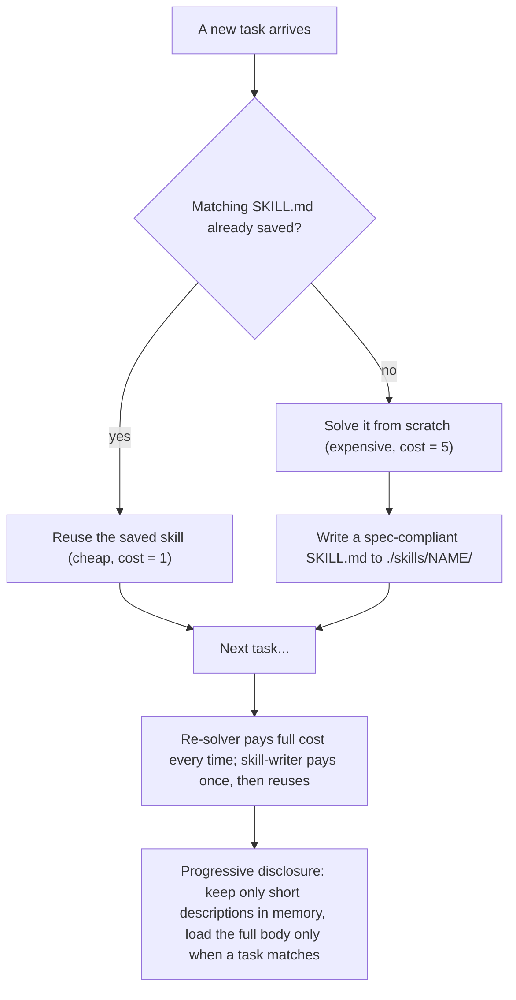

# 🧩 Agents That Write Their Own Skills

An agent that doesn't just *read* skills a human wrote — it **writes its own**. When it
solves something new the hard way, it saves a spec-compliant `SKILL.md`, then reuses it next
time. Over a stream of tasks that cuts total effort almost in half.

The files it writes follow the [Agent Skills open standard](https://agentskills.io/specification)
and would load unmodified in Claude Code, opencode, Goose, etc. No API key. Runs instantly.

## Run

```bash
python demo.py        # writes real SKILL.md files into ./skills — open them to read
```

## How it works (the flow)



**Steps:**
1. For each task, the agent checks whether a saved skill already matches.
2. If yes → reuse it cheaply.
3. If no → solve the hard way once, then **write a `SKILL.md`** (valid YAML front matter +
   instructions) to `./skills/<name>/`.
4. Repeated tasks now hit the saved skill, so total effort drops.
5. **Progressive disclosure** keeps a big library cheap: the agent holds only each skill's
   short description, and reads the full instructions only when a task matches.
